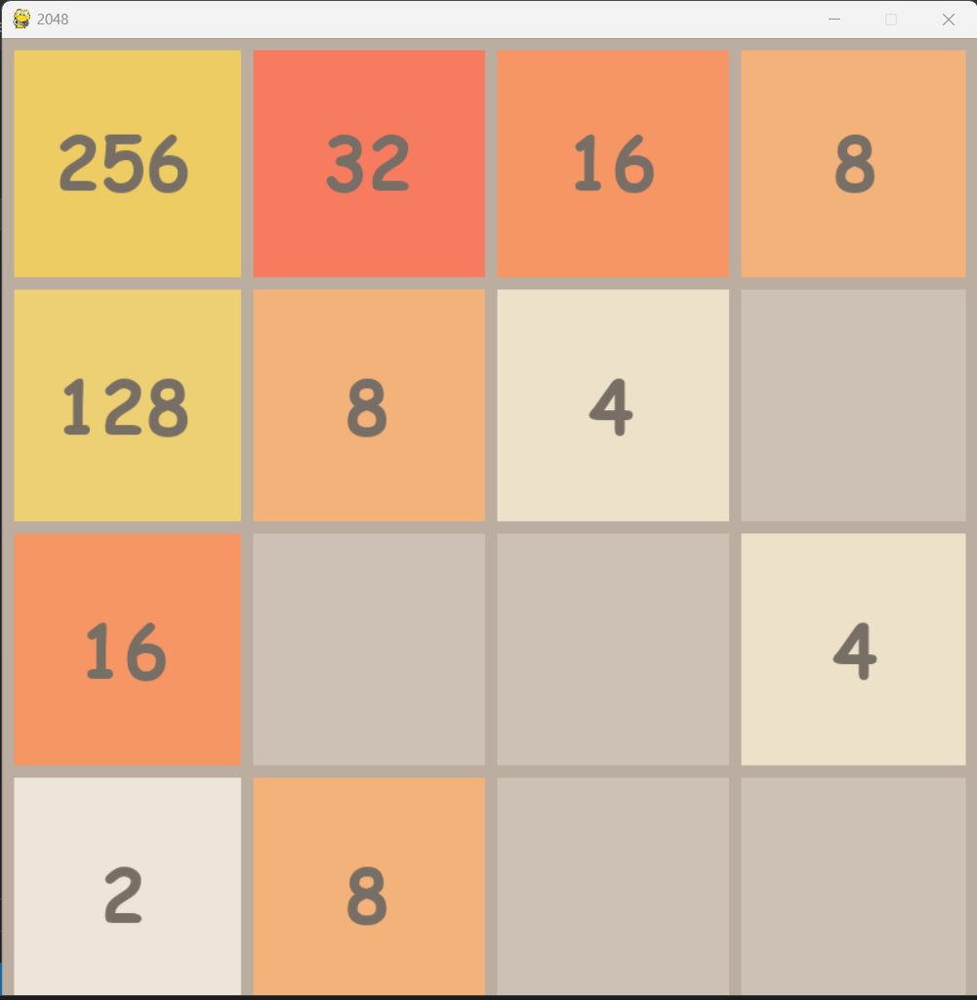

# 2048 Game - Python Implementation with Pygame



## Introduction

This repository contains a Python implementation of the classic 2048 game using the Pygame library. The objective of the game is to slide numbered tiles on a grid to combine them and create a tile with the number 2048.

## Features

- Classic 2048 gameplay
- Colorful and intuitive interface
- Score tracking
- Smooth animations
- Support for keyboard controls

## Installation

1. Clone the repository to your local machine:

    ```
    git clone https://github.com/your-username/2048-game.git
    ```

2. Navigate to the project directory:

    ```
    cd 2048-game
    ```

3. Install the required dependencies using pip:

    ```
    pip install -r requirements.txt
    ```

## How to Play

1. Run the game by executing the following command:

    ```
    python main.py
    ```

2. Use the arrow keys to move the tiles in the desired direction.
3. Tiles with the same number will merge when they collide.
4. Continue merging tiles to reach the 2048 tile and win the game!

## Controls

- Use the arrow keys (Up, Down, Left, Right) to move the tiles in the corresponding direction.

## Contributing

Contributions are welcome! If you would like to contribute to this project, please fork the repository and submit a pull request.

## License

This project is licensed under the [MIT License](LICENSE).
